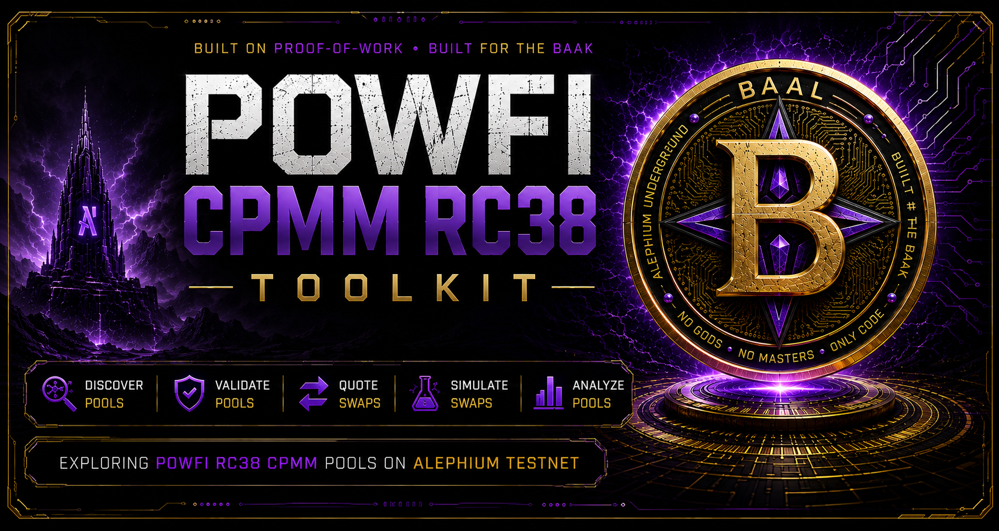
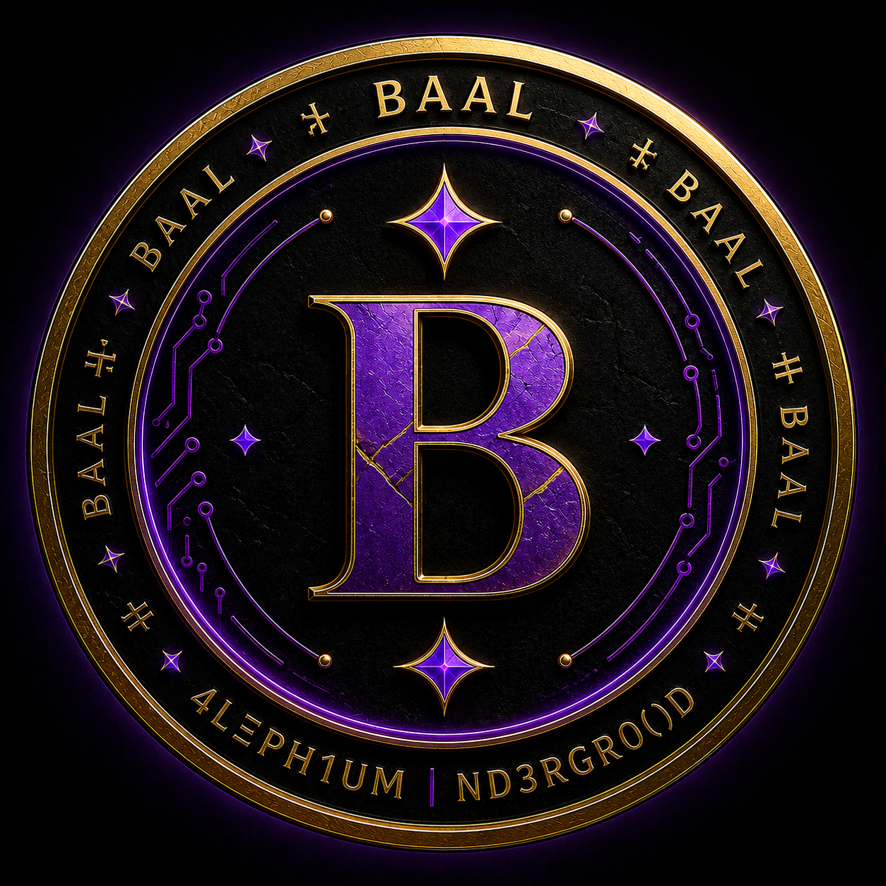
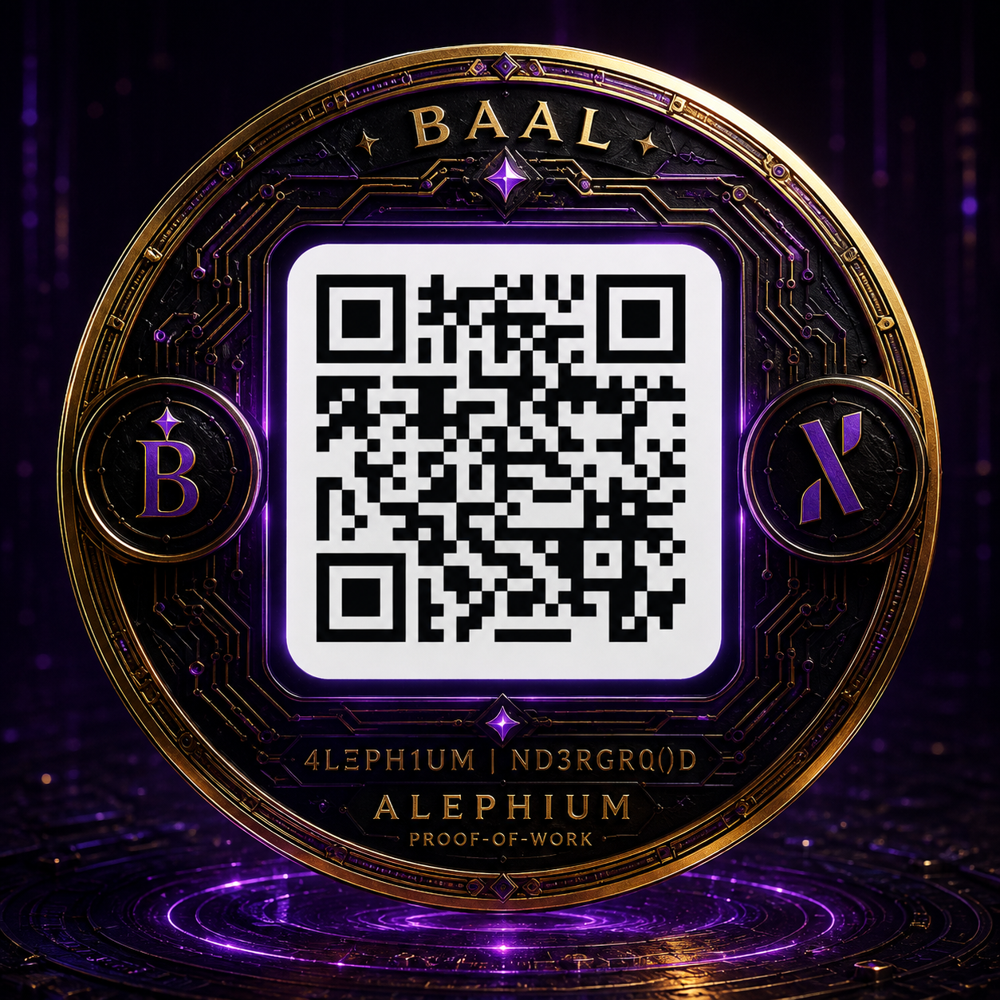

  

# PowFi CPMM RC38 Toolkit

  

A read-only toolkit for exploring **PowFi RC38 pools on Alephium Testnet**.

BAAL / ALPH remains the reference CPMM pool and default example. The generic CPMM tools can discover, validate, quote, simulate, and analyze pairs created by the current RC38 Testnet factory.

Experimental read-only CLMM inspection and contract-backed quotes are also available for the current RC38 Testnet deployment.

## Environment

- PowFi SDK: `0.0.1-rc.38`
- Alephium web3: `3.0.3`
- Network: Alephium Testnet
- Scope: RC38 CPMM + experimental CLMM inspection and quotes
- Mode: READ ONLY

No wallet, signer, or transaction is required.

## Install

    npm install

## Help

    npm run help

## Read the BAAL reference pool

    npm start

This reads the live ALPH / BAAL pool and displays:

- ALPH reserve
- BAAL reserve
- BAAL / ALPH spot ratio
- ALPH / BAAL spot ratio

## Discover CPMM pools

    npm run pools

The command discovers CPMM pairs from the current RC38 Testnet TokenPairFactory events.

At the time of the latest runtime validation, 7 CPMM pools were discovered.

Discovery is dynamic: the count may change as new pairs are created.

## Validate discovered pools

    npm run validate

The validator checks the currently discovered RC38 CPMM pairs against the expected RC38 structure.

Validation includes:

- deterministic pool ID verification
- expected TokenPair code hash
- raw immutable and mutable field layout
- runtime field types
- token IDs stored in the pool state

At the time of the latest runtime validation:

    7/7 RC38 CPMM pools fully validated

This result describes the pools discovered at that time. It is not a guarantee about future pools or other PowFi contract families.

## Simulate a swap

Run a read-only CPMM quote:

    npm run simulate

Default:

    1 ALPH → BAAL

BAAL shorthand is preserved:

    npm run simulate -- 0.1
    npm run simulate -- 5 ALPH
    npm run simulate -- 100 BAAL

Generic CPMM pairs can be selected explicitly:

    npm run simulate -- 1 WETH WBTC
    npm run simulate -- 1 USDTeth USDCeth

Generic syntax:

    npm run simulate -- <AMOUNT> <TOKEN_IN> <TOKEN_OUT>

The simulator displays:

- expected output
- minimum output with 1% slippage
- price impact

The live pool state is resolved first, then the quote is computed locally against that snapshot with `CpmmModule.computeSwapAmount()`.

## Explore multiple quotes

BAAL shorthand:

    npm run quotes -- ALPH
    npm run quotes -- BAAL 10 50 100 250 500

Generic CPMM pair:

    npm run quotes -- WETH WBTC 0.01 0.1 1
    npm run quotes -- USDTeth USDCeth 1 10 100

Generic syntax:

    npm run quotes -- <TOKEN_IN> <TOKEN_OUT> [AMOUNTS...]

For each input size, the explorer displays:

- input amount
- expected output
- price impact

Quotes are calculated locally from the resolved live pool snapshot with `CpmmModule.computeSwapAmount()`.

## Analyze price impact

BAAL shorthand:

    npm run impact -- ALPH
    npm run impact -- BAAL

Generic CPMM pair:

    npm run impact -- WETH WBTC
    npm run impact -- USDTeth USDCeth

The analyzer searches for the maximum input below these price-impact limits:

- 0.5%
- 1.0%
- 2.0%
- 5.0%

The selected live CPMM pool state is fetched once. Threshold calculations are then performed locally against that same snapshot with `CpmmModule.computeSwapAmount()`.

## Token resolution

Known tokens are resolved from the PowFi Testnet token list.

The read-only helper also contains an on-chain fungible-token metadata fallback for token IDs not present in that list.

ALPH is handled as the native Alephium token.

## Read-only architecture

The generic CPMM tools use the current RC38 Testnet factory for pair discovery and read TokenPair state directly from the node.

Pool resolution validates the expected RC38 TokenPair code hash and raw state structure before using reserves.

For listed token IDs, pool resolution can skip factory discovery when both token IDs are supplied directly.

All swap and impact calculations in this toolkit are simulations only.

## Experimental CLMM inspection and quotes

Discover and inspect the CLMM pools created by the current RC38 Testnet PoolFactory:

    npm run clmm-pools

The CLMM reader currently:

- discovers pools from `PoolCreated` factory events
- derives pool addresses from their contract IDs
- reads raw pool state directly from the Alephium node
- validates token0, token1, and config index against the creation event
- resolves token metadata and decimals
- reads fee, tick spacing, current tick, liquidity, and NFT index
- derives the human token1/token0 price from `sqrtPriceX96` using the resolved token decimals

Experimental contract-backed CLMM quotes are also available:

    npm run clmm-quote -- <tokenInId> <tokenOutId> <amount>

The CLMM quote command:

- resolves input and output token decimals
- identifies the matching discovered CLMM pool
- determines the swap direction from token0/token1
- calls the RC38 Pool `simulateSwap` method in read-only mode
- reads the two contract-returned `I256` token deltas
- derives the exact raw output amount from the returned output delta
- formats input and output amounts using their resolved token decimals
- reports fee pips and simulation price-state telemetry

The quote path has been runtime-tested in both swap directions and with 18→18, 6→8, and 8→6 token decimal combinations.

This CLMM support is intentionally **experimental and read-only**. It targets the contract layout observed and runtime-validated with PowFi `0.0.1-rc.38` on Alephium Testnet.

It does not create positions, mint NFTs, swap tokens, sign transactions, or submit transactions.

## BAAL Testnet reference

BAAL Token ID:

    72ff515813051a7d9dde6c63efb8ad4bc623a3577c5ecd6fc4e61ba24e87de00

ALPH / BAAL Pool ID:

    cde61aa8652e515ecbac0dfbf787bdb4d425462eb698f61bdda846939cbb0300

Pool address:

    28YhCKbTHgtAayhbse8pttPuPsrXxDmyNtw4pDYpbWnuV

## Builders

Install the exact SDK version used by this RC38 Testnet experiment:

    npm install --save-exact @alephium/powfi-sdk@0.0.1-rc.38

This repository intentionally focuses on **read-only PowFi RC38 tooling on Alephium Testnet**.

CPMM tooling is the primary scope. CLMM support is limited to experimental read-only inspection and contract-backed quotes for the current RC38 Testnet deployment.

It does not claim compatibility with Mainnet, future PowFi releases, or future contract layouts.

## Safety

- No wallet
- No signer
- No transaction

## Disclaimer

**TESTNET ONLY • EXPERIMENTAL • NO REAL VALUE**

Pool spot ratios, quotes, and simulated outputs are not valuations, price guarantees, or indications of realizable liquidity.

---

## Support the Underground

If this toolkit is useful to you and you want to support the work:

  

**ALPH donation address (Alephium network only):**

`167iHgxZWWxCmtHEKx2izcAcbZM9y3L238VsstbwSNJZo`

**BAAL/4LΞPH1UM |ND3RGR0()D**

---

**BAAL • ALEPHIUM UNDERGROUND** 😈⛓️
